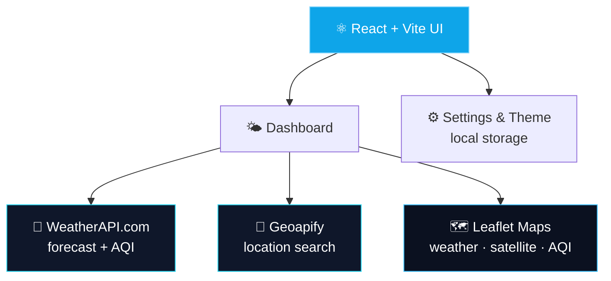

<div align="center">


<a href="https://github.com/mohitjoshi-dev/Weather-Dashboard">
  
</a>

<br/>

**A modern weather dashboard with live forecasts, air quality and interactive maps.**
Fast. Visual. Built for daily use.

<br/>

<a href="https://astonishing-pithivier-e45bce.netlify.app/"></a>
<a href="https://github.com/mohitjoshi-dev/Weather-Dashboard"></a>
<a href="./LICENSE"></a>

<br/><br/>


</div>

<br/>

---

## ✦ The idea

> **Weather data is everywhere. Reading it quickly is the hard part.**

Most weather sites bury the useful stuff under ads and clutter. Weather Dashboard strips it down to what you actually check: **current conditions, a 7-day outlook, air quality, and where you are on the map** — searchable by any city, in a clean dark or light interface.

<div align="center">

| 🔍 **SEARCH** | 📊 **UNDERSTAND** | 🗺️ **VISUALIZE** |
|:---:|:---:|:---:|
| Autocomplete city search | 7-day forecast breakdown | Live weather map |
| India-biased or global | Hourly highlights | Satellite view |
| Instant results | Air Quality Index (AQI) | AQI heatmap |

</div>

---

## ✨ What makes it different

<table>
<tr>
<td width="50%" valign="top">

### 🔍 Smart Location Search
Geoapify-powered autocomplete with an India-first bias, switchable to global search.
**→ Find any city in a couple of keystrokes.**

</td>
<td width="50%" valign="top">

### 🌤️ Full Forecast Picture
Current conditions plus a 7-day outlook, rendered with animated weather icons.
**→ Know what's coming, not just what's now.**

</td>
</tr>
<tr>
<td width="50%" valign="top">

### 🫁 Air Quality, Simplified
A dedicated AQI gauge and heatmap so air quality isn't an afterthought.
**→ See the number and what it actually means.**

</td>
<td width="50%" valign="top">

### 🗺️ Interactive Maps
Live weather and satellite layers built on Leaflet, right inside the dashboard.
**→ Zoom into conditions, not just read them.**

</td>
</tr>
<tr>
<td width="50%" valign="top">

### 🎚️ Your Units, Your Format
Toggle °C/°F and 12h/24h time, saved automatically for next time.
**→ Set it once, forget it.**

</td>
<td width="50%" valign="top">

### 🌗 Light & Dark Themes
A `next-themes`-powered theme switch that respects your system preference.
**→ Comfortable, day or night.**

</td>
</tr>
</table>

---

## 🧩 Core features

<details open>
<summary><b>🌤️ Current Weather & Forecast</b></summary>

<br/>

- Real-time conditions for any searched city
- 7-day forecast with animated weather icons
- Hourly highlights (wind, humidity, pressure, UV, and more)
- Skeleton loading states for a smooth first paint

</details>

<details open>
<summary><b>🔍 Location Search</b></summary>

<br/>

- Autocomplete search powered by Geoapify
- Region bias toggle (India / global)
- Deduplicated, clean result list

</details>

<details open>
<summary><b>🫁 Air Quality</b></summary>

<br/>

- AQI gauge for at-a-glance readability
- AQI heatmap on an interactive map
- Pulled alongside the main forecast call

</details>

<details>
<summary><b>🗺️ Maps</b></summary>

<br/>

- Live weather map layer
- Satellite map view
- Built with Leaflet + React-Leaflet

</details>

<details>
<summary><b>⚙️ Settings & Personalization</b></summary>

<br/>

- Temperature unit: Celsius / Fahrenheit
- Time format: 12-hour / 24-hour
- Search region bias
- Preferences persisted in local storage
- Light / dark theme

</details>

---

## 🖥️ Inside the app

| Module | What it does |
|:--|:--|
| **Dashboard** | Main shell tying search, forecast and maps together |
| **Current Weather** | Live conditions for the selected city |
| **Weekly Forecast** | 7-day outlook with icons |
| **Highlights** | Wind, humidity, pressure and other key stats |
| **Air Quality** | AQI gauge and breakdown |
| **Weather / Satellite Map** | Interactive Leaflet map layers |
| **AQI Map** | Air quality visualized geographically |
| **Settings** | Units, time format, region, theme |

---

## 🏗️ Architecture



---

## 🚀 Run it locally

**1. Clone the repo**

```bash
git clone https://github.com/mohitjoshi-dev/Weather-Dashboard.git
cd Weather-Dashboard
```

**2. Install dependencies**

```bash
npm install
```

**3. Add your environment variables**

Create a `.env` file in the project root:

```env
VITE_WEATHER_API_KEY=your_weatherapi_com_key
VITE_GEOAPIFY_API_KEY=your_geoapify_api_key
```

> Get a free key from [weatherapi.com](https://www.weatherapi.com/) and [geoapify.com](https://www.geoapify.com/).

**4. Start the dev server**

```bash
npm run dev
```

Open the local URL that Vite prints, search a city, and you're in. 🎉

---

## 📁 Project structure

```
Weather-Dashboard/
│
├── public/
│
├── src/
│   ├── api/              # weatherapi.com & geoapify calls
│   ├── assets/           # hero image, icons
│   ├── components/
│   │   ├── layout/       # Dashboard, Sidebar, MainContent
│   │   ├── weather/      # forecast, AQI, maps, gauges
│   │   ├── settings/     # SettingsModal
│   │   ├── skeletons/    # loading states
│   │   └── ui/           # shadcn/ui primitives
│   ├── context/          # Settings & Theme providers
│   ├── hooks/            # useWeather
│   ├── lib/
│   └── main.jsx
│
├── .gitignore
├── components.json
├── eslint.config.js
├── index.html
├── package.json
├── vite.config.js
└── README.md
```

> 🔒 `.env` is intentionally excluded from the public repository.

---

## 🔐 Security

- API keys live in environment variables, never in source code
- `.env` is git-ignored (`.env.example` can be committed as a template)
- Client-side keys (WeatherAPI, Geoapify) are exposed to the browser by design — use provider-side domain/referrer restrictions if you deploy this publicly

---

## 🎨 Design direction

<div align="center">

`DARK-FIRST` · `GLASS SURFACES` · `SOFT GLOW` · `CLEAN TYPE` · `DATA OVER DECORATION` · `MICRO-INTERACTIONS`

</div>

Minimal noise, strong hierarchy, responsive layouts, and Framer Motion used for feel, not spectacle.

---

## 🛣️ Roadmap

- ✅ Live search with autocomplete
- ✅ Current weather + 7-day forecast
- ✅ Air Quality Index gauge & map
- ✅ Interactive weather & satellite maps
- ✅ Unit, time format & region settings
- ✅ Light / dark theme
- ✅ Production deployment
- ⬜ Saved / favorite locations
- ⬜ Hourly forecast timeline
- ⬜ Severe weather alerts
- ⬜ PWA / offline support
- ⬜ More granular map layers

---

## 🧪 What I learned building this

React 19 + Vite · Tailwind v4 & shadcn/ui · consuming third-party weather & geocoding APIs · Leaflet map integration · context-based settings & theming · skeleton loading states · Framer Motion micro-interactions · deployment.

The goal: turn raw weather data into something people actually want to check every day.

---

<div align="center">

## 👨‍💻 Built by

**Mohit Joshi**
B.Tech Information Technology · Frontend / Full-Stack Developer

<a href="https://github.com/mohitjoshi-dev"></a>

<br/>

### If Weather Dashboard was useful

⭐ **Star** the repo · 🍴 **Fork** it · 💬 **Share feedback**

<br/>

<a href="https://astonishing-pithivier-e45bce.netlify.app/"></a>


</div>